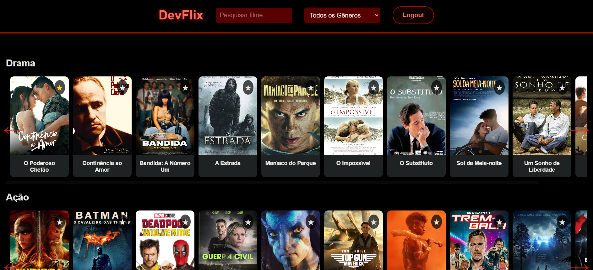

# DevFlix - Plataforma de Streaming de Filmes



**DevFlix** é uma plataforma de streaming de filmes desenvolvida como parte do meu portfólio. O projeto foi criado para demonstrar habilidades em desenvolvimento web, utilizando HTML, CSS e JavaScript. A aplicação simula uma experiência de streaming, com funcionalidades como login, registro, pesquisa de filmes, filtragem por gênero, e uma interface interativa para visualização de detalhes dos filmes.

## Funcionalidades Principais

- **Login e Registro de Usuários**: Os usuários podem criar uma conta ou fazer login para acessar a plataforma.
- **Tela de Carregamento**: Uma tela de carregamento com animação é exibida enquanto o conteúdo é carregado.
- **Pesquisa e Filtragem**: Os usuários podem pesquisar filmes por título e filtrar por gênero.
- **Listagem de Filmes**: Os filmes são exibidos em seções organizadas por gênero, com uma interface de rolagem horizontal.
- **Modal de Detalhes**: Ao clicar em um filme, um modal é aberto com informações detalhadas, como descrição, ano, gênero e avaliação.
- **Favoritos**: Os usuários podem marcar filmes como favoritos, que são armazenados localmente.
- **Avaliação de Filmes**: Os usuários podem avaliar filmes com uma classificação de 1 a 5 estrelas.
- **Responsividade**: A interface é responsiva, adaptando-se a diferentes tamanhos de tela.

## Tecnologias Utilizadas

- **HTML5**: Estruturação do conteúdo da página.
- **CSS3**: Estilização da interface, incluindo animações e efeitos visuais.
- **JavaScript**: Lógica de interação, manipulação do DOM e gerenciamento de estado.
- **LocalStorage**: Armazenamento local de dados de usuários, favoritos e avaliações.

## Como Executar o Projeto


1. **Clone o repositório**:
   ```bash
   git clone https://github.com/seu-usuario/devflix.git
   cd devflix


Desenvolvido por Felipe Prado como parte do meu portfólio de desenvolvimento web.